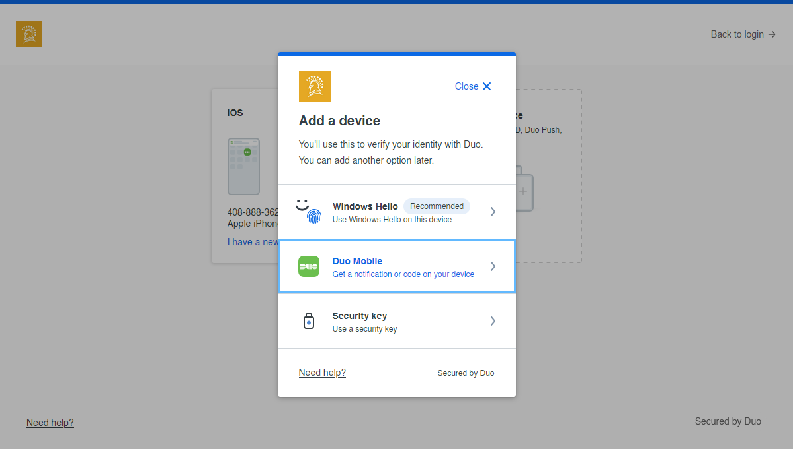
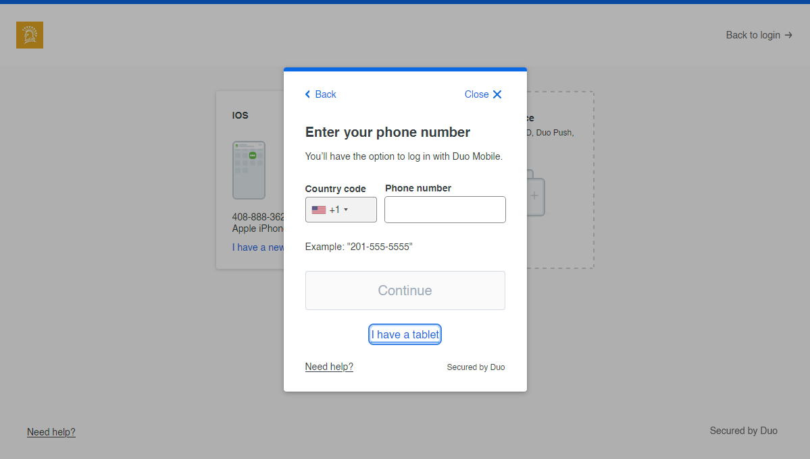
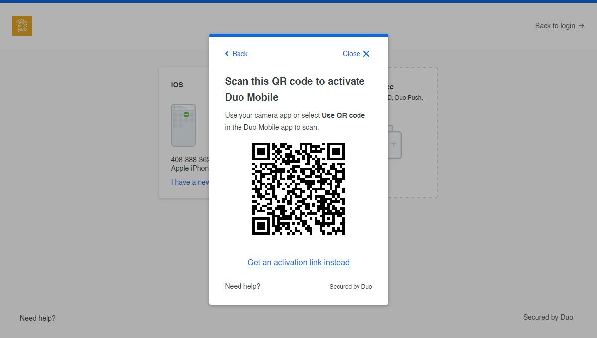
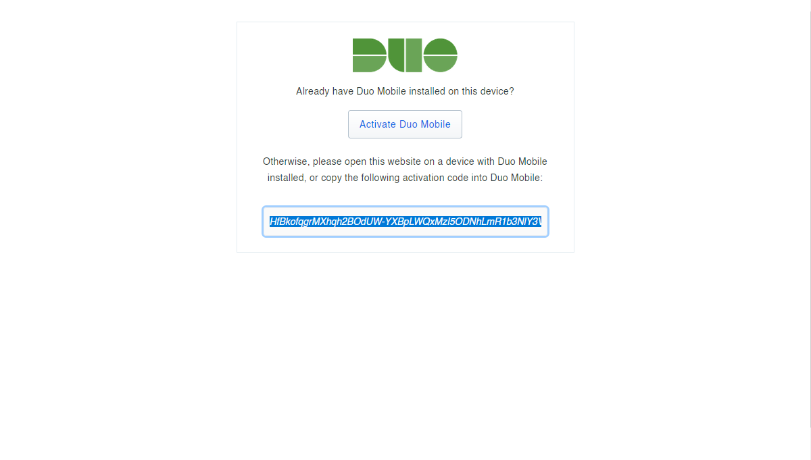

# auto-duo

Automatically approve Duo Push requests without a phone.

```bash
cargo run
```

1. Add a Duo Mobile device



2. “I have a tablet”



3. Go to activation link



4. Copy activation code



5. Paste activation code


6. Keep program running on a server